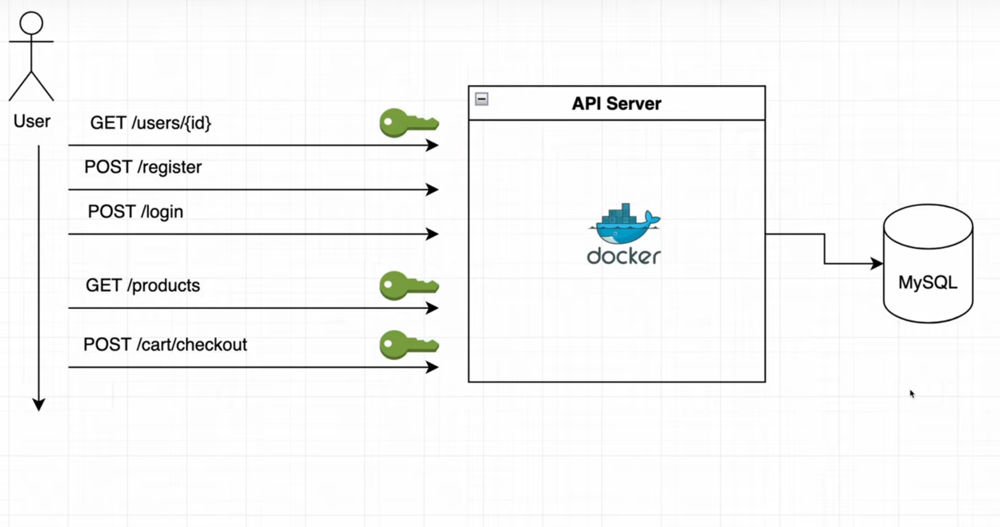

# shopping-cart

A rest-api made with golang, for guys/girls to by stuff. \\//**🙃🙃🙃**\\//

## Some code guidelines followed

1. cmd - all the entry-points for our applications are stores in CMD
   directory

   1.1. migrate - migrate will store all the migration files for our
   database changes
   1.2 api - api will contain the business logic of our application
